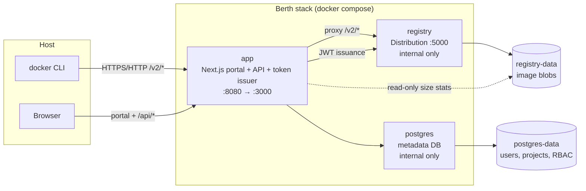

# Berth

[](LICENSE)

A self-hosted OCI artifact registry with Harbor-class identity, projects, and RBAC — delivered as a `docker compose up` stack with a modern Next.js portal.

## Quick start

From the repository root:

```bash
docker compose -f docker/compose.yml up -d --build
curl -sf http://localhost:8080/api/health
```

Open **http://localhost:8080**, sign in with the bootstrap admin (see [Install guide](docs/install.md)), create a project, then push an image:

```bash
docker login localhost:8080
docker tag hello-world:latest localhost:8080/my-project/hello:1.0
docker push localhost:8080/my-project/hello:1.0
```

Default dev credentials are set in `docker/compose.yml` (`admin@localhost` / `test-admin-password`). Change these before any non-local deployment.

### Production

For a hardened deployment with TLS, secrets, and token signing certificates, follow the **[Production setup guide](docs/production-setup.md)**.

## Architecture

Berth runs three containers on an internal Docker network. Only the **app** exposes a port to the host; the registry and Postgres are internal.



| Component | Role |
|-----------|------|
| **app** | Portal UI, REST API, session auth, OIDC, registry JWT issuer, `/v2/*` proxy |
| **registry** | CNCF Distribution (`registry:3`) — blob storage, token auth enforcement |
| **postgres** | Platform metadata (users, projects, RBAC, audit) — not image content |

Clients (`docker login`, `docker push`) use the **same host and port** as the portal. The app validates (or issues) bearer tokens and proxies registry traffic to the internal `registry:5000` service.

## Documentation

| Guide | Purpose |
|-------|---------|
| [Production setup](docs/production-setup.md) | End-to-end deploy with TLS, secrets, and first push |
| [Install](docs/install.md) | First boot, bootstrap admin, password recovery |
| [TLS](docs/tls.md) | HTTPS with a reverse proxy or compose edge TLS |
| [Backup](docs/backup.md) | Postgres dump + `registry-data` volume |
| [Key rotation](docs/key-rotation.md) | Token signing key rollover (`ROOTCERTBUNDLE`) |
| [Garbage collection](docs/gc.md) | Reclaim storage after deletes |
| [Production checklist](docs/production-checklist.md) | Rate limits, secrets, TLS, backups |

Reference:

- [Product specification](docs/spec.md)
- [Implementation roadmap](ROADMAP.md)
- [Decision log](DECISIONS.md)

## Environment reference

Copy [`.env.example`](.env.example) for local development outside Docker. In compose, most variables are set in [`docker/compose.yml`](docker/compose.yml).

### Required for production

| Variable | Description |
|----------|-------------|
| `SESSION_SECRET` | Random secret for session cookies — **change from dev default** |
| `APP_URL` | Public URL (`https://registry.example.com`) — OIDC redirects, token realm, cookies |
| `TOKEN_SIGNING_KEY` or `TOKEN_SIGNING_KEY_PATH` | RSA private key for registry JWTs |
| `TOKEN_CERT` or `TOKEN_CERT_PATH` | Matching public cert (also mounted as registry trust bundle) |
| `DATABASE_URL` | Postgres connection string |
| `REGISTRY_INTERNAL_URL` | Internal registry URL (`http://registry:5000` in compose) |

### Bootstrap & auth

| Variable | Default | Description |
|----------|---------|-------------|
| `BOOTSTRAP_ADMIN_EMAIL` | `admin@localhost` | First system admin email |
| `BOOTSTRAP_ADMIN_PASSWORD` | *(auto-generated)* | If unset on first boot, password is logged once and must be changed on login |
| `OIDC_ISSUER`, `OIDC_CLIENT_ID`, `OIDC_CLIENT_SECRET` | — | Optional single OIDC provider |

### Token & session

| Variable | Default | Description |
|----------|---------|-------------|
| `TOKEN_ISSUER` | `registry` | JWT `iss` — must match registry config |
| `TOKEN_TTL_SECONDS` | `300` | Registry JWT lifetime (seconds) |
| `SESSION_TTL_SECONDS` | `604800` | Portal session lifetime (7 days) |
| `REGISTRY_AUTH_TOKEN_SERVICE` | `registry` | JWT audience / registry service name |

### Rate limiting

| Variable | Default | Description |
|----------|---------|-------------|
| `RATE_LIMIT_LOGIN_MAX_ATTEMPTS` | `10` | Per-IP and per-email limit on `/api/auth/login` |
| `RATE_LIMIT_TOKEN_MAX_ATTEMPTS` | same as login | Per-IP and per-identifier limit on `/api/auth/token` (compose dev uses `200`) |
| `RATE_LIMIT_WINDOW_SECONDS` | `60` | Sliding window for the above |

### Registry proxy & storage

| Variable | Default | Description |
|----------|---------|-------------|
| `REGISTRY_PROXY_TIMEOUT_MS` | `600000` | Upstream timeout for large layer uploads |
| `REGISTRY_DATA_PATH` | `/var/lib/registry` | Path to registry blob store (mounted read-only in app for GC stats) |

### Portal

| Variable | Default | Description |
|----------|---------|-------------|
| `TAGLIST_PAGE_SIZE` | `100` | Tags per page in the portal |
| `THEME_DEFAULT` | `system` | Default theme (`system`, `light`, `dark`) |

### Registry service (compose)

Set on the `registry` container — see [spec §9.2](docs/spec.md) and [`docker/compose.yml`](docker/compose.yml):

| Variable | Purpose |
|----------|---------|
| `REGISTRY_AUTH_TOKEN_REALM` | `{APP_URL}/api/auth/token` |
| `REGISTRY_AUTH_TOKEN_ROOTCERTBUNDLE` | Path to PEM cert bundle trusted for JWT validation |

## Development

```bash
pnpm install
pnpm lint
pnpm typecheck
pnpm test
pnpm dev
```

CI uses [`docker/compose.ci.yml`](docker/compose.ci.yml) for integration and E2E tests (`pnpm test:e2e`).

## License

Apache License 2.0 — see [LICENSE](LICENSE).
