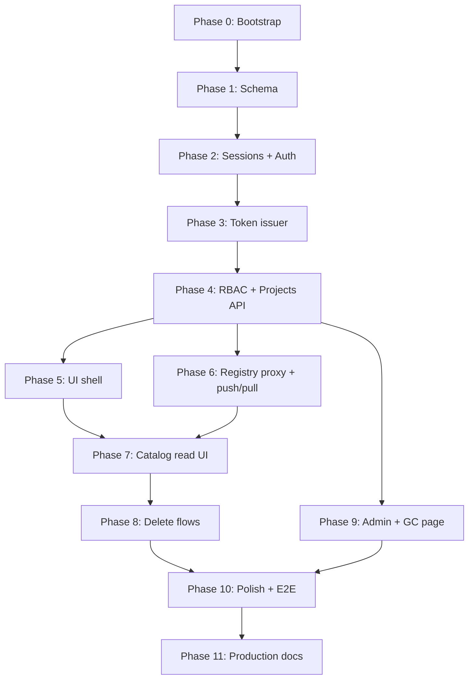

# Berth — Implementation Roadmap

**Authoritative spec:** [`docs/spec.md`](docs/spec.md)  
**Decision log:** [`DECISIONS.md`](DECISIONS.md) (create in Phase 0; append as you go)  
**Status:** Execution checklist for autonomous development. **Phase order is strict** — do not start a phase until the previous phase's exit criteria pass.

---

## How to use this with Cursor

### Autonomous development (recommended)

Use the **orchestrator skill** to dispatch phased work with verifier gates:

```text
@orchestrator orchestrate P0
```

See [`docs/ORCHESTRATOR-GUIDE.md`](docs/ORCHESTRATOR-GUIDE.md) and [`.cursor/skills/orchestrator/SKILL.md`](.cursor/skills/orchestrator/SKILL.md). Progress is tracked in [`.cursor/skills/workspace-notes.md`](.cursor/skills/workspace-notes.md).

| Command | Behavior |
|---------|----------|
| `orchestrate P0` | Run Phase 0 until Done or blocked |
| `implement P6` | Single phase |
| `implement P0-T05` | Single checkbox task within Phase 0 |
| `orchestrate through P3` | Sequential P0→P3 |

### Manual single-phase prompt (without orchestrator)

1. **One phase per session** (or per PR). Do not scope-creep into later phases.
2. **Read `docs/spec.md` §0** — no Harbor/docker-registry-ui forks, no bulk `@coss/ui` install.
3. **Record assumptions** in `DECISIONS.md` (§Appendix C).
4. **Verify exit criteria** with real commands (compose up, curl, docker login/push).
5. **Commits:** `feat(scope)[P6]: …` with `Task: P6` in body — see `.cursor/rules/02-git-workflow.mdc`.

---

## Global MVP definition of done

An operator can run `docker compose up -d`, open the portal, sign in (OIDC or bootstrap admin), create a project, invite a member, then from their laptop:

```bash
docker login <host>
docker push <host>/<project>/hello:1.0
```

…and browse/delete tags in the portal **as the same user**, with RBAC enforced on every registry operation via issued tokens — not a shared service account.

---

## Dependency graph



Phases 5 and 6 can run in parallel **after** Phase 4, but both must complete before Phase 7.

---

## Phase 0 — Repo bootstrap & compose skeleton

**Goal:** Runnable three-service stack with CI; no product features yet.

### Tasks

- [ ] Initialize Next.js 15 (App Router, TypeScript strict, standalone output) with pnpm
- [ ] Create target directory layout per spec §11 (`app/`, `components/`, `lib/`, `docker/`, `drizzle/`, `tests/`)
- [ ] Add root `LICENSE` (Apache-2.0 — already present), `README.md` (badge + one-liner), `package.json` `"license": "Apache-2.0"`
- [ ] Create `DECISIONS.md` — seed with Appendix C resolved decisions from spec
- [ ] Record copyright holder line for source headers in `DECISIONS.md`
- [ ] `docker/compose.yml`: `app`, `registry` (`distribution/registry:3`), `postgres:16-alpine`
- [ ] Internal network only for `registry` and `postgres`; `app` exposes `8080:3000` (or `443:3000`)
- [ ] Volumes: `registry-data`, `postgres-data`; token cert bundle mount path planned
- [ ] Registry config: `auth: token`, placeholder realm/service/issuer, `REGISTRY_STORAGE_DELETE_ENABLED=true`
- [ ] App stub: health route `GET /api/health` returns 200
- [ ] `docker/Dockerfile` — multi-stage, `node:20-alpine`, standalone Next output
- [ ] CI workflow: install, lint, typecheck (Vitest scaffold OK, no tests required yet)
- [ ] `.env.example` with all vars from spec §9.1

### Key files

| Path | Purpose |
|------|---------|
| `docker/compose.yml` | Default install |
| `docker/registry/config.yml` | Distribution token auth config |
| `docker/Dockerfile` | App image |
| `app/api/health/route.ts` | Liveness |
| `DECISIONS.md` | Decision log |

### Exit criteria

- [ ] `docker compose -f docker/compose.yml up -d` starts all three services
- [ ] `curl http://localhost:8080/api/health` → 200
- [ ] `registry` is **not** reachable on a published host port (internal only)
- [ ] CI passes on a clean clone

---

## Phase 1 — Postgres schema & bootstrap admin

**Goal:** Drizzle schema, migrations, first-boot admin creation.

### Tasks

- [ ] Add Drizzle + drizzle-kit; configure `DATABASE_URL`
- [ ] Schema tables (spec §8): `users`, `projects`, `project_members`, `sessions`, `project_invites`, `audit_log`
- [ ] Migration on app boot (or entrypoint `pnpm db:migrate`)
- [ ] `GET /api/ready` — checks DB + registry TCP/HTTP reachability
- [ ] Bootstrap admin logic (spec §3.4):
  - If `BOOTSTRAP_ADMIN_PASSWORD` set → use it
  - Else generate random password, log **once** behind banner, never persist
  - Force password change on first login (flag on user or session)
- [ ] Password hashing: bcrypt
- [ ] Unit tests: migration idempotency, bootstrap runs only when no admin exists

### Exit criteria

- [ ] Fresh `docker compose up` creates schema and admin user
- [ ] Password appears in logs exactly once on first boot
- [ ] Restart does **not** re-print password
- [ ] `GET /api/ready` → 200 when DB + registry up

---

## Phase 2 — Local auth, OIDC, sessions

**Goal:** Portal can sign in/out; session cookie; `/api/auth/me`.

### Tasks

- [ ] DB-backed `sessions` table usage (spec §4.3): `expires_at`, `revoked_at`
- [ ] `POST /api/auth/login` — email/password → session cookie
- [ ] `POST /api/auth/logout` — destroy session + set `revoked_at`
- [ ] `GET /api/auth/me` — current user + system role
- [ ] Session cookie: `HttpOnly`, `Secure`, `SameSite=Lax`
- [ ] CSRF: mutating `/api/*` routes require `X-Requested-With: registry-portal` header (exclude token endpoint and `/v2/*`)
- [ ] Rate limit `/api/auth/login` (spec §9.1 in-process limiter)
- [ ] OIDC via `openid-client` (single provider — spec §5.1):
  - `GET /api/auth/oidc/start`
  - `GET /api/auth/oidc/callback`
- [ ] User upsert on OIDC login (`oidc_sub`, email, name)
- [ ] Invite auto-accept on login when email matches + `email_verified: true` (spec §5.5)
- [ ] Integration tests: login → me → logout; session revocation

### Exit criteria

- [ ] Local login sets session; `/api/auth/me` returns user
- [ ] Logout invalidates session; subsequent `me` → 401
- [ ] OIDC flow works against a test IdP (Keycloak container in CI or mocked)
- [ ] Rate limit returns 429 after threshold
- [ ] CSRF: POST without header → 403

---

## Phase 3 — Token issuer & registry trust

**Goal:** `docker login` works against the stack.

### Tasks

- [ ] Generate token signing keypair; mount cert bundle for registry `REGISTRY_AUTH_TOKEN_ROOTCERTBUNDLE`
- [ ] Pick JWT algorithm (RS256 or ES256) — record in `DECISIONS.md`
- [ ] Include `x5c` header on issued JWTs (spec §4.2 belt-and-suspenders)
- [ ] `GET /api/auth/token` — Distribution token spec (spec §4.3, §7.1)
  - Accept Basic auth (username/password) for CLI
  - Accept session cookie for portal-originated token requests
  - Query params: `service`, `scope`
  - TTL: `TOKEN_TTL_SECONDS` (default 300)
- [ ] Rate limit `/api/auth/token`
- [ ] Wire registry config: realm, service, issuer match app env
- [ ] Pin exact `registry:3` image digest; verify token validation with `x5c` + bundle
- [ ] Unit tests: JWT claim shape, scope parsing, expiry

### Exit criteria

- [ ] `docker login localhost:8080` succeeds with bootstrap admin credentials
- [ ] `curl -v localhost:8080/v2/` returns 401 with `WWW-Authenticate` pointing at `/api/auth/token`
- [ ] Token endpoint returns valid JWT for `repository:test/repo:pull` scope (403 if project missing — full RBAC in Phase 4)

---

## Phase 4 — RBAC, projects, members API

**Goal:** Control-plane CRUD with authorization; foundation for portal and token scopes.

### Tasks

- [ ] RBAC module (`lib/rbac/`): system roles + project roles matrix (spec §5.3)
- [ ] Fresh Postgres role check on every mutating request (spec §4.3)
- [ ] Projects API (spec §7.2):
  - `GET/POST /api/projects`
  - `GET/PATCH/DELETE /api/projects/[id]`
  - Create project → creator becomes project `admin`
  - Delete: 409 if repos non-empty; `force=true` cascade (spec §5.4)
- [ ] Members API (spec §7.3) + invites (spec §5.5):
  - Add by email → `project_invites` if user absent
  - List shows pending invites
- [ ] Token issuance: intersect requested scopes with role; reject unknown project with `403 project_not_found` (spec §5.2)
- [ ] Public project: unauthenticated pull-only token for `repository:project/*:pull`
- [ ] Audit log writes for: project delete/force-delete, member role change, member removal (spec §8)
- [ ] Unit tests: full RBAC matrix (role × action × public/private)
- [ ] Integration tests: create project → add member → token scopes differ by role

### Exit criteria

- [ ] API tests pass for all project/member routes
- [ ] Developer cannot delete tags via token; maintainer can
- [ ] Push token for non-existent project → 403 with `project_not_found`
- [ ] Admin system role bypasses project checks

---

## Phase 5 — coss UI shell (login, layout, projects list)

**Goal:** Authenticated portal skeleton; no registry catalog yet.

### Prerequisite

Phase 4 complete (projects API exists).

### Tasks

- [ ] Init coss: `npx shadcn@latest init @coss/style` — follow `.agents/skills/coss/SKILL.md`
- [ ] Install **Shell batch only** (spec Appendix B): `button`, `menu`, `separator`, `badge`, `breadcrumb`, `skeleton`, `spinner`, `kbd`, `toast`
- [ ] **Verify license header** on each copied coss file → record in `DECISIONS.md` (spec §16)
- [ ] Root layout: `ToastProvider` + `AnchoredToastProvider`
- [ ] Header + breadcrumb navigation (no sidebar — spec Appendix B)
- [ ] Theme: light / dark / system (`THEME_DEFAULT`)
- [ ] Routes:
  - `/login` — local form + OIDC button (if configured)
  - `/` → redirect to `/projects`
  - `/projects` — list + create project dialog
- [ ] TanStack Query provider; session check via `/api/auth/me`
- [ ] Protected route middleware / layout guard
- [ ] Force password change flow for bootstrap admin

### Exit criteria

- [ ] Unauthenticated users redirect to `/login`
- [ ] Login → projects list → create project works end-to-end in browser
- [ ] Theme toggle persists
- [ ] Toast on mutation success/error

---

## Phase 6 — Registry proxy & docker push/pull

**Goal:** CLI push/pull through app proxy with correct auth.

### Prerequisite

Phases 3 and 4 complete.

### Tasks

- [ ] `/v2/*` catch-all route proxying to `registry:5000` (spec §4.1.1, §7.6)
  - Stream request/response bodies (no buffering)
  - Rewrite `Location` headers from internal host to public host
  - Pass through `Content-Length`, chunked encoding, `Range`/`Content-Range`
  - Opt out of Next.js body size limits on this route
  - Configurable long timeouts for upload paths
- [ ] **Always** proxy through app — no dev shortcut exposing registry port (spec Appendix C)
- [ ] Validate token on proxy path before forwarding (Bearer JWT)
- [ ] Integration test: create project → `docker push` image → `docker pull` succeeds
- [ ] Integration test: public project anonymous `docker pull`
- [ ] Integration test: multi-chunk push (large layer) does not OOM

### Exit criteria

- [ ] `docker push localhost:8080/my-project/hello:1.0` works for project member
- [ ] Non-member push → denied
- [ ] `docker pull` works on public project without login
- [ ] Upload `Location` header rewrite verified (push does not fail mid-upload)

---

## Phase 7 — Portal catalog, tags, tag detail (read)

**Goal:** Browse registry content via `/api/*`; no deletes yet.

### Prerequisites

Phases 5 and 6 complete.

### Tasks

- [ ] Distribution client (`lib/registry/`): catalog, tags list, manifest fetch — uses **logged-in user's** token (spec §7.4)
- [ ] API routes:
  - `GET /api/projects/[id]/catalog`
  - `GET /api/projects/[id]/repos/[...name]/tags`
  - `GET /api/projects/[id]/repos/[...name]/tags/[tag]`
  - `GET .../tags/[tag]/siblings`
- [ ] Install coss **Catalog + Tags + Detail** batches (Appendix B)
- [ ] Routes:
  - `/p/[project]` — repository catalog
  - `/p/[project]/r/[...repo]` — tag table (TanStack Table + Virtual)
  - `/p/[project]/r/[...repo]/t/[tag]` — digest, platforms, history, copy pull command
- [ ] nuqs: pagination, search, sort on tag list
- [ ] Loading skeletons, empty states, error alerts with retry
- [ ] `Ctrl+K` command palette (`p-command-1` particle)

### Exit criteria

- [ ] After push, portal shows repo and tag within 30s (query refresh)
- [ ] Tag detail shows multi-arch info when applicable
- [ ] Copy `docker pull` command works (anchored toast)
- [ ] Command palette navigates to project/repo

---

## Phase 8 — Delete flows

**Goal:** Tag delete, bulk delete, repo delete, sibling warnings.

### Tasks

- [ ] `DELETE` tag, `POST` bulk-delete, `DELETE` repository (orchestrated manifest deletes — spec §6.3, §7.4)
- [ ] Sibling-digest detection + `AlertDialog` warning (particle `p-alert-dialog-1`)
- [ ] Bulk delete: confirmation dialog for N>5; typed confirmation phrase
- [ ] Repository delete: same confirmation pattern
- [ ] GC info `Alert` on delete success (storage reclaimed after manual GC — spec §6.4)
- [ ] Install coss components: `alert-dialog`, `dialog`, `checkbox`, `table`, `toolbar`
- [ ] Audit log entries for deletes
- [ ] Integration tests: delete tag → absent from list; sibling warning path

### Exit criteria

- [ ] Maintainer can delete tag; developer cannot
- [ ] Bulk delete 10 tags requires confirmation
- [ ] Delete entire repository removes all tags
- [ ] Sibling warning shown when digest shared

---

## Phase 9 — Admin, project settings, GC status page

**Goal:** User management, project settings, operator GC runbook.

### Tasks

- [ ] `/p/[project]/settings` — members, roles, visibility toggle, danger zone (delete project)
- [ ] Install coss **Settings** batch: `form`, `field`, `fieldset`, `switch`, `radio-group`
- [ ] `/admin` — user list, create local user (admin only)
- [ ] `GET /api/admin/users`, `POST /api/admin/users`
- [ ] `/admin/gc` — storage usage + copy-paste GC commands (spec §3.1)
  - Mount `registry-data` read-only into app for size calculation
  - **No** live GC trigger button in MVP
  - Warning: stop/read-only registry before GC
- [ ] `GET /api/admin/gc/status`
- [ ] Pending invite edge case UI (unverified OIDC email — spec §5.5)

### Exit criteria

- [ ] System admin can create users and access `/admin`
- [ ] Non-admin gets 403 on admin routes
- [ ] GC page shows volume size and correct `docker compose run ... garbage-collect` command
- [ ] Project settings: add/remove member, change role

---

## Phase 10 — Polish, accessibility, E2E

**Goal:** Production-quality UX and automated regression suite.

### Tasks

- [ ] Responsive down to 375px
- [ ] Keyboard navigation for tables, dialogs, command palette
- [ ] Focus management in overlays (coss rules)
- [ ] Consistent error/loading/empty states across all routes
- [ ] `docker/compose.ci.yml` for CI integration environment
- [ ] E2E (Playwright): login → create project → push (fixture or API) → browse → delete tag
- [ ] E2E: OIDC login path (if CI IdP available)
- [ ] Vitest coverage: RBAC, token scopes, JWT shape (target: critical paths, not 100%)
- [ ] CI runs full pyramid on every PR (spec §13)

### Exit criteria

- [ ] Playwright suite green in CI
- [ ] No axe-critical a11y violations on main routes (manual or automated spot-check)
- [ ] All portal routes from spec §6.1 implemented

---

## Phase 11 — Production docs & hardening guides

**Goal:** Operator can deploy beyond localhost.

### Tasks

- [ ] `README.md`: quickstart, architecture diagram, env reference
- [ ] `docs/install.md`: `docker compose up`, first-boot, bootstrap password recovery
- [ ] `docs/tls.md`: reverse proxy **and** app-managed certs options
- [ ] `docs/backup.md`: Postgres dump + `registry-data` volume
- [ ] `docs/key-rotation.md`: token signing key rollover procedure (spec §3.5)
- [ ] `docs/gc.md`: manual garbage collection runbook (expand §3.1)
- [ ] Production checklist: rate limiting, TLS, backups, key rotation
- [ ] Optional: self-signed certs in default compose with documented upgrade path

### Exit criteria

- [ ] New operator can follow docs cold-start → push → backup without reading source
- [ ] Key rotation doc matches implemented bundle behavior

---

## Post-MVP backlog (do not implement before Phase 11)

| Priority | Feature | Spec reference |
|----------|---------|----------------|
| P1 | Robot accounts + CI tokens | §1.3, §12 |
| P2 | Audit log UI | §12 |
| P3 | Webhooks | §12 |
| P4 | GC-runner sidecar (opt-in, socket isolated) | §3.1 |
| P5 | Redis job worker | §3.1, §12 |
| P6 | Vulnerability scanning (Trivy) | §1.3, §12 |
| P7 | LDAP / AD auth | §5.1, §12 |
| P8 | Helm charts / non-image OCI artifacts | §1.3 |
| P9 | Replication | §1.3 |

---

## Testing matrix (build incrementally)

| Phase | Unit | Integration | E2E |
|-------|------|-------------|-----|
| 0 | — | health | — |
| 1 | migrations | ready endpoint | — |
| 2 | session helpers | login/logout | — |
| 3 | JWT claims | docker login | — |
| 4 | RBAC matrix | projects API | — |
| 5 | — | — | login UI (optional) |
| 6 | — | push/pull | — |
| 7 | registry client parsers | catalog API | browse |
| 8 | — | delete API | delete flow |
| 9 | — | admin API | settings |
| 10 | full | compose.ci | full suite |
| 11 | — | — | smoke |

---

## Risk register (watch during implementation)

| Risk | Mitigation | Phase |
|------|------------|-------|
| Registry rejects JWT without `x5c` | Include `x5c` + bundle; pin image digest | 3 |
| Proxy breaks chunked push | Stream + Location rewrite tests with large layer | 6 |
| Next.js body size limit on `/v2/*` | Route segment config opt-out | 6 |
| Role change not effective immediately | Fresh DB check per request, short token TTL | 2, 4 |
| AGPL coss components | Per-file license verify at copy-in | 5 |
| GC corruption | Document stop/read-only; no HTTP trigger MVP | 9, 11 |

---

## Suggested PR / branch strategy

| Branch | Phases | Notes |
|--------|--------|-------|
| `feat/phase-0-bootstrap` | 0 | Foundation |
| `feat/phase-1-schema` | 1 | |
| `feat/phase-2-auth` | 2 | |
| `feat/phase-3-tokens` | 3 | |
| `feat/phase-4-rbac` | 4 | Largest API surface |
| `feat/phase-5-ui-shell` | 5 | Can parallel with 6 |
| `feat/phase-6-proxy` | 6 | Can parallel with 5 |
| `feat/phase-7-catalog` | 7 | |
| `feat/phase-8-delete` | 8 | |
| `feat/phase-9-admin` | 9 | |
| `feat/phase-10-e2e` | 10 | |
| `docs/phase-11-production` | 11 | Docs-only OK |

Keep MRs small and phase-scoped. Do not merge Phase N+1 work into Phase N MRs.

---

*Last updated: aligned with `docs/spec.md` as of MVP spec revision.*
