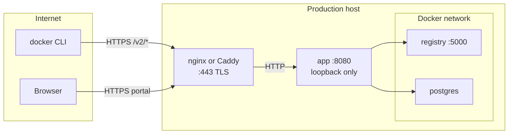

# Production setup guide

This guide walks through deploying Berth on a Linux server with Docker Compose, TLS via a **host-level reverse proxy**, production secrets, and your first `docker push`. For local development, use the [Install guide](install.md) instead.

## Overview

Berth runs three containers (**app**, **registry**, **postgres**) on an internal Docker network. In production:

- Only the **app** is reachable on the host — bound to **127.0.0.1:8080**
- A **reverse proxy** on the host terminates HTTPS on ports 80/443 and forwards to the app
- Docker clients use the same public hostname as the portal (`docker login registry.example.com`)



| Component | Production role |
|-----------|-----------------|
| **app** | Portal, API, registry JWT issuer, `/v2/*` proxy |
| **registry** | OCI blob storage (internal only) |
| **postgres** | Users, projects, RBAC metadata (internal only) |
| **Reverse proxy** | TLS certificates, public hostname |

## Prerequisites

- Linux server with **Docker Engine** and **Compose v2** (v2.24+ recommended for `ports: !reset` in overrides)
- A domain name with **DNS A/AAAA** pointing at the server (e.g. `registry.example.com`)
- Ports **80** and **443** open for the reverse proxy
- Firewall: block direct access to Postgres (`5432`) and registry (`5000`) if the dev compose ports are still published

## 1. Directory layout

Keep secrets **outside** the git clone:

```text
/opt/berth/
  repo/                         # git clone of Berth
  secrets/
    session.secret              # SESSION_SECRET value
    postgres.password           # Postgres password
    token-signing-key.pem       # Registry JWT private key
    token-signing-cert.pem      # Registry JWT public cert
    rootcert.pem                # Registry trust bundle (initially = signing cert)
  compose.prod.yml              # copied from docker/compose.prod.example.yml
```

Clone the repository:

```bash
sudo mkdir -p /opt/berth/secrets
sudo chown "$USER:$USER" /opt/berth
git clone https://github.com/mdg-labs/berth.git /opt/berth/repo
cd /opt/berth/repo
```

## 2. Generate secrets and token signing certificates

Berth uses **two different kinds** of certificates:

| Type | Purpose | Created in this step? |
|------|---------|----------------------|
| **Token signing** (RSA) | Registry JWTs between app and Distribution | **Yes** |
| **TLS** (HTTPS) | Browser and `docker login` transport | **No** — obtained later via certbot/Caddy |

Token signing material is **not** your HTTPS certificate. See [TLS guide](tls.md) for the distinction.

### Session secret

```bash
openssl rand -base64 32 | tee /opt/berth/secrets/session.secret
chmod 600 /opt/berth/secrets/session.secret
```

### Postgres password

```bash
openssl rand -base64 24 | tee /opt/berth/secrets/postgres.password
chmod 600 /opt/berth/secrets/postgres.password
```

### Token signing keypair

```bash
cd /opt/berth/secrets

openssl genrsa -out token-signing-key.pem 2048
openssl req -new -x509 \
  -key token-signing-key.pem \
  -out token-signing-cert.pem \
  -days 825 \
  -subj "/CN=berth-token-issuer" \
  -sha256

# Registry trust bundle — single cert until you rotate keys
cp token-signing-cert.pem rootcert.pem

chmod 600 token-signing-key.pem
chmod 644 token-signing-cert.pem rootcert.pem
```

**Do not** reuse the dev keys in `docker/token/dev-signing-key.pem` or `docker/registry/certs/rootcert.pem`.

## 3. Configure production compose override

### Copy example files

```bash
cp docker/compose.prod.example.yml /opt/berth/compose.prod.yml
cp docker/registry/config.prod.yml docker/registry/config.prod.local.yml
```

Edit `/opt/berth/compose.prod.yml`:

1. Replace every `registry.example.com` with your hostname
2. Set `BOOTSTRAP_ADMIN_EMAIL` to your admin email
3. Confirm secret mount paths match `/opt/berth/secrets/`

Edit `docker/registry/config.prod.local.yml` (or the file you mount):

1. Set `auth.token.realm` to `https://<your-host>/api/auth/token`

Update the volume mount in `compose.prod.yml` to point at your edited registry config:

```yaml
- ./registry/config.prod.local.yml:/etc/distribution/config.yml:ro
```

### URL alignment (critical)

These three values **must** use the same public `https://` hostname:

| Location | Variable / field |
|----------|------------------|
| **app** | `APP_URL` |
| **registry** container env | `REGISTRY_AUTH_TOKEN_REALM` → `{APP_URL}/api/auth/token` |
| **registry** config file | `auth.token.realm` |

Distribution merges environment variables with the config file; keep both in sync to avoid subtle `docker login` failures.

### Export environment for compose

```bash
export BERTH_SECRETS_DIR=/opt/berth/secrets
export POSTGRES_PASSWORD="$(cat /opt/berth/secrets/postgres.password)"
export SESSION_SECRET="$(cat /opt/berth/secrets/session.secret)"
```

Add these to a root-owned env file (e.g. `/opt/berth/berth.env`) and `source` it before `docker compose` if you prefer.

### What the override changes

Compared to the dev [`docker/compose.yml`](../docker/compose.yml):

| Setting | Production |
|---------|------------|
| App port | `127.0.0.1:8080:3000` only |
| Postgres / registry ports | Unpublished (`ports: !reset []`) |
| `SESSION_SECRET` | Strong random value |
| `BOOTSTRAP_ADMIN_PASSWORD` | **Unset** — generated once in logs |
| Token keys | Mounted from `secrets/` |
| Rate limits | `RATE_LIMIT_TOKEN_MAX_ATTEMPTS: "10"` |

### Pre-built image (optional)

Instead of building from source, pin a release image in `compose.prod.yml`:

```yaml
app:
  image: ghcr.io/mdg-labs/berth:v0.1.0
  # comment out build: block
```

You must still mount production token keys — the image ships with dev signing material baked in ([`docker/Dockerfile`](../docker/Dockerfile)).

## 4. Start the stack

From the repository root:

```bash
cd /opt/berth/repo
docker compose -f docker/compose.yml -f /opt/berth/compose.prod.yml up -d --build
```

Wait for health checks:

```bash
docker compose -f docker/compose.yml -f /opt/berth/compose.prod.yml ps
curl -sf http://127.0.0.1:8080/api/health
curl -sf http://127.0.0.1:8080/api/ready
```

Both should return HTTP 200. `/api/ready` confirms migrations completed.

## 5. TLS with an external reverse proxy

Configure TLS on the **host**, not inside the Berth containers.

### Option A — nginx (recommended walkthrough)

Install nginx and certbot, then copy the example config:

```bash
sudo cp docker/nginx.example.conf /etc/nginx/sites-available/berth
# Edit server_name and certificate paths
sudo ln -s /etc/nginx/sites-available/berth /etc/nginx/sites-enabled/
```

Obtain a Let's Encrypt certificate:

```bash
sudo certbot certonly --nginx -d registry.example.com
```

Test and reload:

```bash
sudo nginx -t && sudo systemctl reload nginx
```

See [`docker/nginx.example.conf`](../docker/nginx.example.conf) for required proxy settings: unlimited upload size, 600s read timeout, and `X-Forwarded-*` headers.

### Option B — Caddy

Copy and edit the example:

```bash
sudo cp docker/Caddyfile.example /etc/caddy/Caddyfile
# Replace registry.example.com
sudo systemctl reload caddy
```

Caddy obtains and renews Let's Encrypt certificates automatically. See [`docker/Caddyfile.example`](../docker/Caddyfile.example).

### Verify HTTPS

```bash
curl -sf https://registry.example.com/api/health
curl -sf https://registry.example.com/api/ready
```

## 6. First boot and bootstrap admin

On first start the app:

1. Runs database migrations
2. Creates a bootstrap system admin
3. Prints a **one-time** random password to logs (because `BOOTSTRAP_ADMIN_PASSWORD` is unset)

Retrieve the password:

```bash
docker compose -f docker/compose.yml -f /opt/berth/compose.prod.yml logs app \
  | grep -A3 "BOOTSTRAP ADMIN PASSWORD"
```

Example output:

```text
=== BOOTSTRAP ADMIN PASSWORD (shown once) ===
Email: admin@example.com
Password: <random>
=== END BOOTSTRAP ADMIN PASSWORD ===
```

Sign in:

1. Open **https://registry.example.com/login**
2. Use the bootstrap email and password
3. Change your password when prompted

If the password is lost after first boot, see [Password recovery](install.md#password-recovery) in the install guide.

## 7. Verify registry end-to-end

### Create a project

In the portal: **Projects** → **Create project** (e.g. `my-project`).

### Push an image

From your workstation:

```bash
docker login registry.example.com
# Username: your bootstrap email
# Password: your admin password

docker pull hello-world:latest
docker tag hello-world:latest registry.example.com/my-project/hello:1.0
docker push registry.example.com/my-project/hello:1.0
```

Confirm the tag appears in the portal under **my-project** → **hello**.

Pushing to a project that does not exist returns **403** — create the project first.

## Troubleshooting

| Symptom | Fix |
|---------|-----|
| `curl` to `/api/health` fails on loopback | Check `docker compose ps` — wait for `healthy` |
| HTTPS works but `docker login` fails | Align `APP_URL`, `REGISTRY_AUTH_TOKEN_REALM`, and `config.yml` realm |
| Token / 401 errors on push | Signing key must match `rootcert.pem` — see [Key rotation](key-rotation.md) |
| Push returns 403 | Create the project in the portal; check RBAC |
| Wrong client IP in audit log | Ensure proxy sets `X-Forwarded-For` and `X-Real-IP` |

## Optional configuration

### OIDC

Set on the **app** service in `compose.prod.yml`:

```yaml
OIDC_ISSUER: https://idp.example.com
OIDC_CLIENT_ID: berth
OIDC_CLIENT_SECRET: <secret>
```

Register redirect URI: `{APP_URL}/api/auth/oidc/callback`

### SMTP (password reset and invites)

```yaml
SMTP_HOST: smtp.example.com
SMTP_PORT: "587"
SMTP_USER: berth
SMTP_PASSWORD: <secret>
EMAIL_FROM: noreply@example.com
```

See [`.env.example`](../.env.example) for all optional variables.

## Post-deployment

1. Complete the [Production checklist](production-checklist.md)
2. Schedule [backups](backup.md) — Postgres dump + `registry-data` volume
3. Document [key rotation](key-rotation.md) for your team
4. Plan [garbage collection](gc.md) after delete-heavy periods

### Upgrades

```bash
# Backup first — see backup.md
cd /opt/berth/repo
git pull
docker compose -f docker/compose.yml -f /opt/berth/compose.prod.yml up -d --build
curl -sf https://registry.example.com/api/ready
```

## Related docs

- [Install](install.md) — local dev quick start
- [TLS](tls.md) — TLS options in depth
- [Backup](backup.md) — restore procedures
- [Key rotation](key-rotation.md) — token signing key rollover
- [Garbage collection](gc.md) — reclaim storage
- [Production checklist](production-checklist.md) — final verification
- [README](../README.md) — architecture and environment reference
